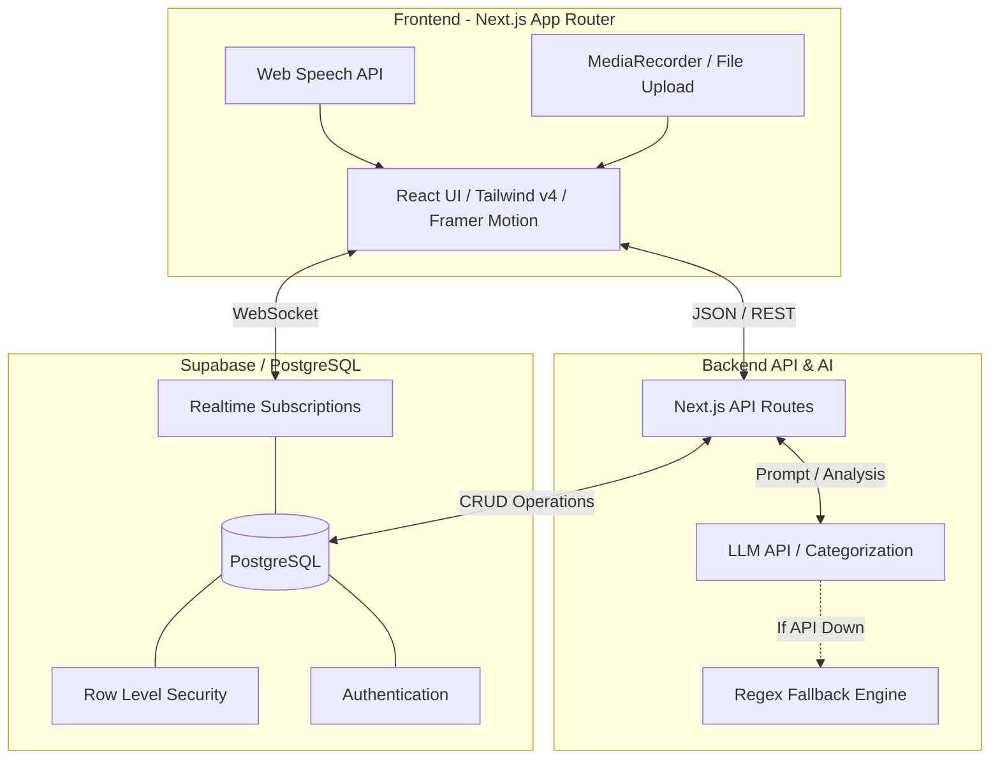

# 🎓 Campus Solver

> **AI-Powered Campus Grievance & Maintenance Management Platform**
> 
> *Built for HackIndia Summer of Codesfest 2.0 | Track 3: Campus Problem Solver*
>
> 🌐 **[Live Demo → campus-solver-mu.vercel.app](https://campus-solver-mu.vercel.app)**

## 🛑 The Problem
Campus complaints disappear into a black hole. Students report issues — broken lights, water leaks, network outages — but there's no transparency, no accountability, and no resolution tracking. Staff are overwhelmed with disorganized requests, and Admins lack visibility into campus-wide maintenance health.

## 🚀 Our Solution
**Campus Solver** is a modern, AI-first grievance management system that ensures every complaint is tracked, automatically categorized, assigned, and resolved — with full accountability.

 *(Add a collage of Student, Staff, and Admin dashboards here)*

### ✨ Key Features
- **🧠 AI Auto-Categorization:** FreeLLMAPI-powered analysis instantly categorizes complaints, predicts priority, routes to the correct department, and senses student sentiment.
- **🎙️ Voice-to-Complaint:** Built-in Web Speech API integration lets students report issues just by talking.
- **⏱️ SLA Enforcement:** Automatic timers with visual countdowns. Breached SLAs trigger auto-escalation to management.
- **🛡️ Role-Based Access:** Distinct, secure portals for Students, Staff, and Admins — each seeing exactly and only what they need.
- **📊 Real-Time Analytics:** Heatmaps and charts showing campus-wide complaint patterns and department performance.
- **📱 Mobile-First Design:** Fully responsive UI with slide-out sidebars and fluid Framer Motion animations.
- **🔍 Duplicate Detection:** AI flags similar complaints before submission to prevent redundancy.
- **📍 QR Code Integration:** Scan a code on campus infrastructure to instantly open a pre-filled issue report.

## 🏗️ Architecture



## 🛠️ Tech Stack

| Category | Technology |
|----------|------------|
| **Frontend** | Next.js 16 (App Router), React 19, TypeScript, Tailwind CSS v4 |
| **Animations & Charts** | Framer Motion (motion/react), Recharts |
| **Backend** | Next.js API Routes, Supabase (PostgreSQL) |
| **Authentication** | Supabase Auth, Row Level Security (RLS) |
| **AI & Logic** | FreeLLMAPI (GPT-4o-mini prompt engineering), Zod validation |
| **Deployment** | Vercel (Frontend), Supabase Cloud (Database) |

## 💻 Getting Started

### Prerequisites
- Node.js 22+
- npm 10+
- Supabase Project (Free Tier is fine)

### Installation

1. **Clone the repository**
   ```bash
   git clone https://github.com/Yadnyesh-patil/RUNTIME-TERROR.git
   cd RUNTIME-TERROR
   ```

2. **Install dependencies**
   ```bash
   npm install
   ```

3. **Set up Environment Variables**
   ```bash
   cp .env.example .env.local
   ```
   *Edit `.env.local` with your Supabase keys and LLM API keys.*

4. **Database Setup**
   - Go to your Supabase SQL Editor
   - Run the schema: `supabase/schema.sql`
   - Run the seed data to populate dummy staff/complaints: `supabase/seed.sql`

5. **Run the Development Server**
   ```bash
   npm run dev
   ```
   *Open [http://localhost:3000](http://localhost:3000) in your browser.*

## 👥 Team

| Name | Role | GitHub |
|------|------|--------|
| **Yadnyesh Patil** | Full Stack + AI Integration | [@Yadnyesh-patil](https://github.com/Yadnyesh-patil) |
| **Yug Wankhede** | Frontend + UI/UX + Timeline | [@YugWankhede](https://github.com/YugWankhede) |

## 🎯 Evaluation Criteria Alignment

- **Innovation:** Real-time AI categorization, voice input, and duplicate detection eliminate manual triage.
- **Technical Excellence:** Strict TypeScript typing, Next.js 16 server components, complex Supabase RLS policies, and robust error fallbacks.
- **Impact:** Directly solves a massive administrative bottleneck (1000+ unorganized complaints/month) with measurable resolution metrics.
- **Scalability:** Built on serverless infrastructure with strict multi-tenant ready database schema and role isolation.
- **Demo Quality:** 22 fully functional routes, responsive across all devices, real-time WebSockets, and zero fake "smoke and mirrors" UI.

## 📄 License
This project is licensed under the MIT License.

---
*Built with passion, caffeine, and urgency for HackIndia Summer of Codesfest 2.0*
