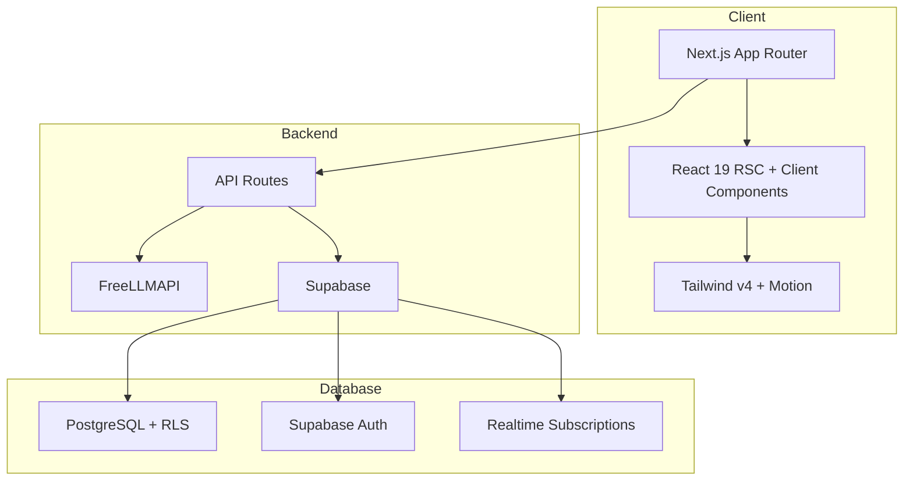

# Campus Solver

> AI-Powered Campus Grievance Management System

Built for **HackIndia Summer of Codesfest 2.0** | Track 3: Campus Problem Solver

## The Problem
Campus complaints disappear. Students report issues — broken lights, water leaks, network outages — but there's no transparency, no accountability, no resolution tracking. Staff don't know what's assigned to them. Admins can't see the full picture.

## Our Solution
Campus Solver is an AI-powered grievance management system that ensures every complaint is tracked, categorized, assigned, and resolved — with full accountability.

### Key Features
- **AI Auto-Categorization**: FreeLLMAPI-powered analysis categorizes complaints, predicts priority, and routes to the right department
- **SLA Enforcement**: Automatic timers with visual countdown. Breached SLAs trigger escalation
- **Role-Based Dashboards**: Student, Staff, and Admin views — each sees exactly what they need
- **Real-time Status Timeline**: Full audit trail from submission to resolution
- **Analytics & Heatmap**: Campus-wide complaint patterns, staff performance, resolution metrics
- **QR Code Tracking**: Public tracking page — scan a code, see live status
- **Duplicate Detection**: AI flags similar complaints to prevent redundancy

## Tech Stack
| Layer | Technology |
|-------|------------|
| Frontend | Next.js 16, React 19, TypeScript, Tailwind CSS v4 |
| Backend | Next.js API Routes, Supabase (PostgreSQL + Auth + RLS) |
| AI/ML | FreeLLMAPI (GPT-4o-mini) for categorization, priority prediction, duplicate detection |
| Charts | Recharts |
| Animations | Motion (motion/react) |
| Validation | Zod |
| Deployment | Vercel + Supabase Cloud |

## Architecture


## Getting Started

### Prerequisites
- Node.js 22+
- npm 10+
- Supabase project

### Installation
```bash
git clone https://github.com/Yadnyesh-patil/campus-solver.git
cd campus-solver
npm install
```

### Environment Variables
```bash
cp .env.example .env.local
# Edit .env.local with your Supabase credentials
```

### Database Setup
```bash
# Run schema in Supabase SQL Editor
# File: supabase/schema.sql
# Then run seed data
# File: supabase/seed.sql
```

### Run Development Server
```bash
npm run dev
```

## Team
| Name | Role | GitHub |
|------|------|--------|
| Yadnyesh Patil | Full Stack + AI Integration | [@Yadnyesh-patil](https://github.com/Yadnyesh-patil) |
| Shivam Agrawal | Backend + Database + Analytics | [@ShivamAgrawal](https://github.com/ShivamAgrawal) |
| Yug Wankhede | Frontend + UI/UX + Timeline | [@YugWankhede](https://github.com/YugWankhede) |

## Evaluation Criteria Alignment
| Criteria | How We Address It |
|----------|-------------------|
| Innovation | AI-powered categorization + duplicate detection + sentiment analysis |
| Technical Excellence | Next.js 16 + TypeScript + Supabase RLS + Zod validation |
| Impact | Directly solves campus grievance opacity — measurable resolution metrics |
| Scalability | Role-based RLS, SLA automation, department routing |
| Demo Quality | 10 fully functional routes, realistic mock data, smooth animations |

## License
MIT

---
*Built with urgency and care for HackIndia Summer of Codesfest 2.0*
